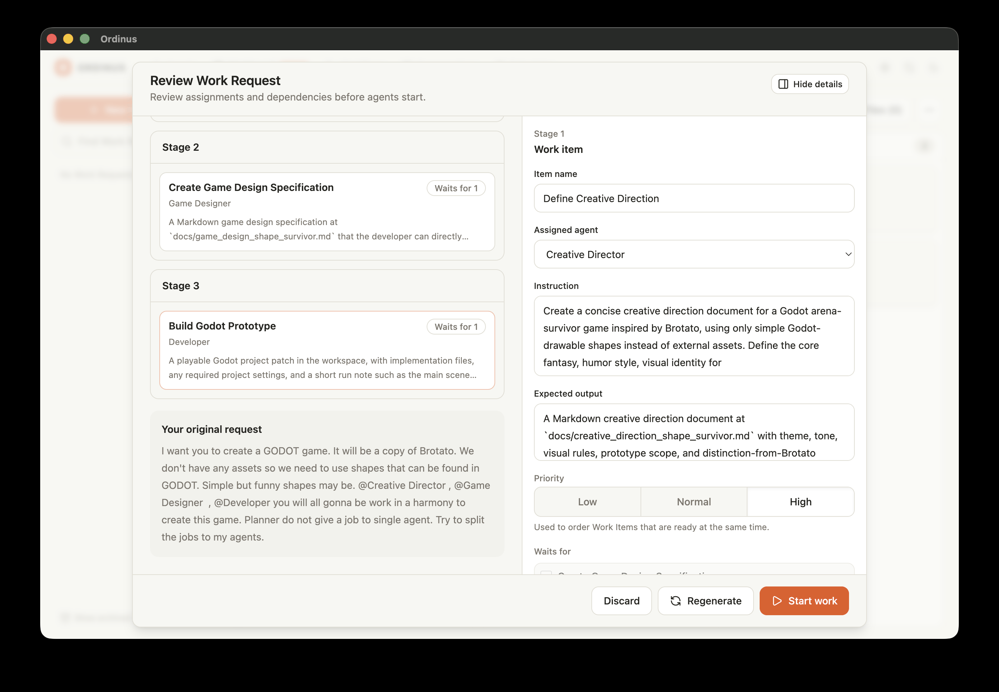
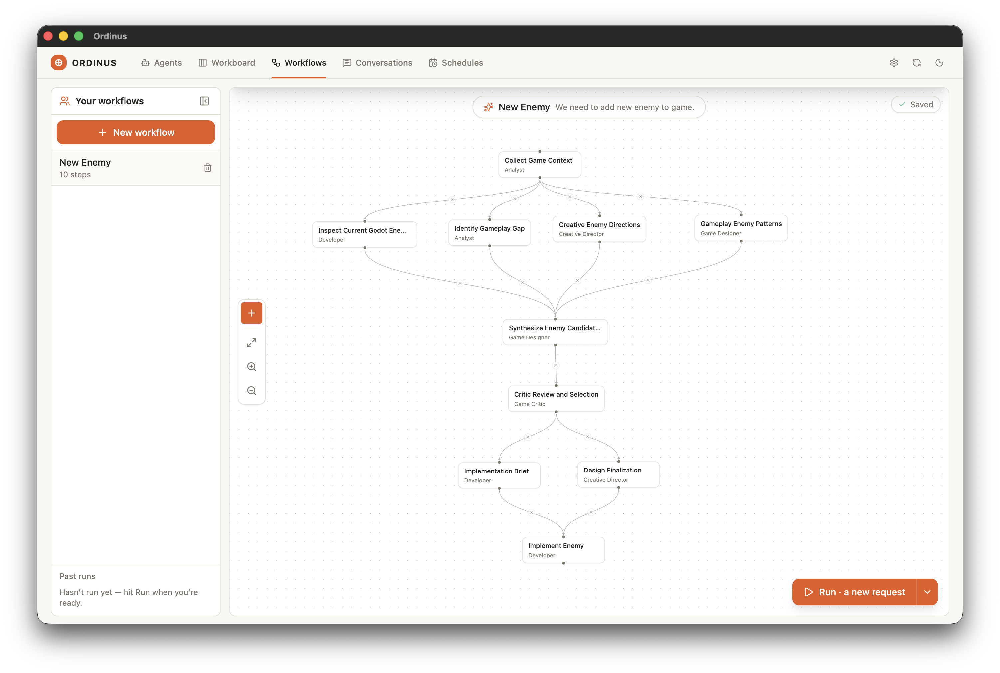

# Ordinus

> A local-first desktop app that lets you compose AI agents from your own Codex / Claude / Gemini CLIs into scheduled workflows — all your data stays on your machine.

<!-- TODO: replace placeholder pitch above with final wording -->

[](https://github.com/muratgur/ordinus/releases/latest)
[](LICENSE)


---

## Download

Pick your platform from the [latest release](https://github.com/muratgur/ordinus/releases/latest):

| Platform | File |
|---|---|
| **macOS** (Apple Silicon) | `Ordinus-<version>.dmg` |
| **Windows** (x64) | `ordinus-<version>-setup.exe` |

> Builds are unsigned for now, so your OS will warn you before launching. The app is fully local-first — nothing is uploaded anywhere.

### First launch — macOS

The DMG is unsigned, so macOS Gatekeeper will refuse to open it with a misleading **"Ordinus is damaged and can't be opened"** message. The app is not damaged — Gatekeeper just blocks unsigned apps that carry the quarantine attribute set by your browser.

1. Open the `.dmg` and **drag `Ordinus.app` onto the `Applications` shortcut** (don't double-click the icon inside the DMG window — that runs it from a read-only volume).
2. In Terminal, strip the quarantine attribute, then launch:

   ```bash
   xattr -dr com.apple.quarantine /Applications/Ordinus.app
   open /Applications/Ordinus.app
   ```

You only do this once. After the first launch, the app opens normally.

### First launch — Windows

SmartScreen will show **"Windows protected your PC"**. Click **More info** → **Run anyway**.

The installer puts Ordinus under `Program Files` and creates a Start Menu / Desktop shortcut. Subsequent launches open without prompts.

## What it does


**Agents.** Compose roles (article writer, code reviewer, security engineer, …) backed by your local AI CLIs. Each agent has a profile, capabilities, and its own conversation space.



**Workflow Designer.** Visually wire agents and tasks into a DAG. Compiles down to a runnable plan; reuse the same engine across manual runs and schedules.


**Workboard.** Watch tasks execute, inspect provider output, and steer runs in flight.

## Why local-first

- Your prompts, conversations, and workflow definitions live in a local SQLite database — no cloud account, no per-seat pricing.
- Providers run as local CLI processes (Codex, Claude, Gemini). Ordinus orchestrates them; it does not proxy your tokens through a third-party service.
- No telemetry. No phone-home.

## Build from source

Requires Node.js `22.13.0+` and the platform toolchains electron-builder needs.

```bash
git clone https://github.com/muratgur/ordinus.git
cd ordinus/app
npm ci
npm run dev          # run in dev mode
npm run build:mac    # produce a .dmg under app/dist
npm run build:win    # produce a .exe installer under app/dist
```

For Windows builds on a non-signing machine, use `npm run build:win:local`.

## Status

Ordinus is pre-1.0. APIs, schemas, and the UI may change between releases. The 0.x line is a public showcase — feedback welcome, but breaking changes will happen without ceremony.

## Built with Claude Code

This project is developed AI-assisted using [Claude Code](https://claude.ai/code). The `.claude/skills/` directory contains the project-specific skills (architecture guides, IPC contracts, secure-boundary rules, etc.) that shape how the AI collaborates on the codebase. If you're curious about agent-assisted development workflows, those files are worth a read.

## Documentation

- [Architecture](docs/architecture.md)
- [Provider runtime contract](docs/provider-runtime-contract.md)
- [Packaging & release](docs/packaging-release.md)
- [Product brief](docs/product-brief.md)
- [Agent guide](AGENTS.md)

## Contributing

See [CONTRIBUTING.md](CONTRIBUTING.md). Small, well-scoped changes are easiest to land.

## Security

See [SECURITY.md](SECURITY.md) for private vulnerability reporting.

## License

[MIT](LICENSE) © 2026 Murat Gür
