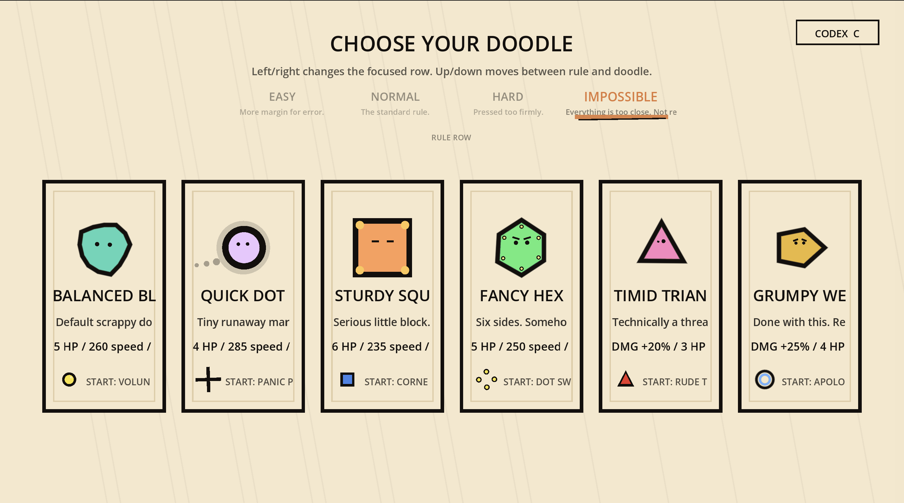
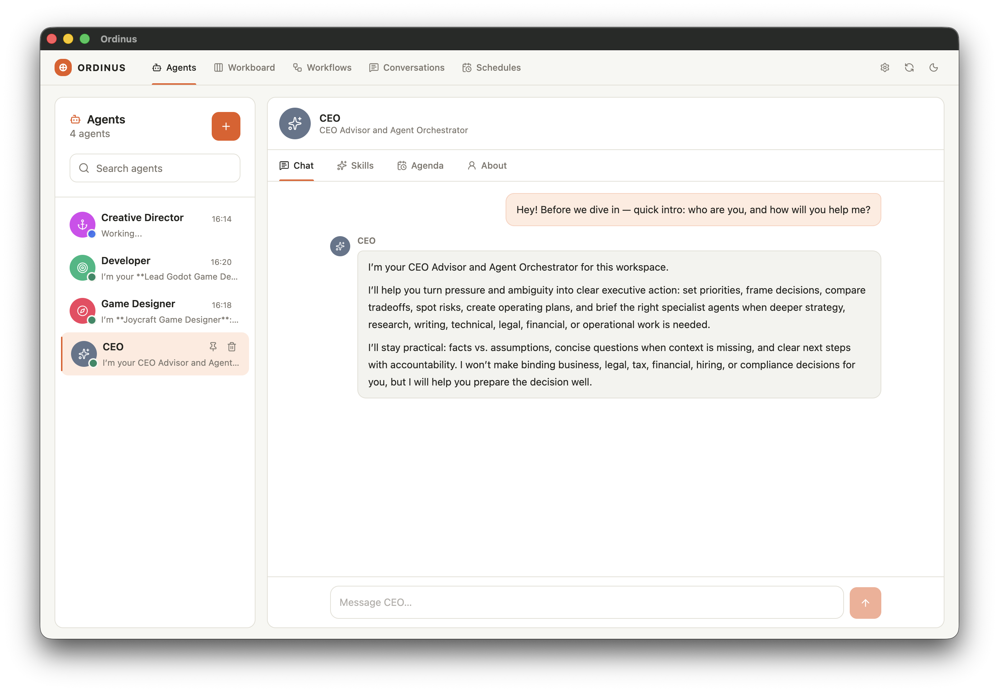
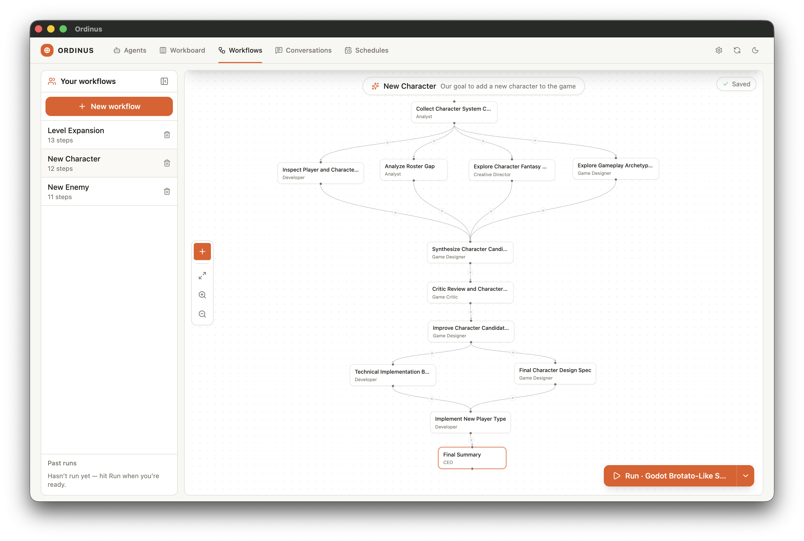
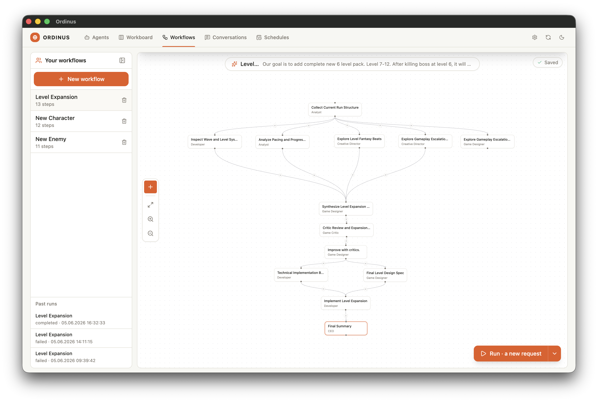
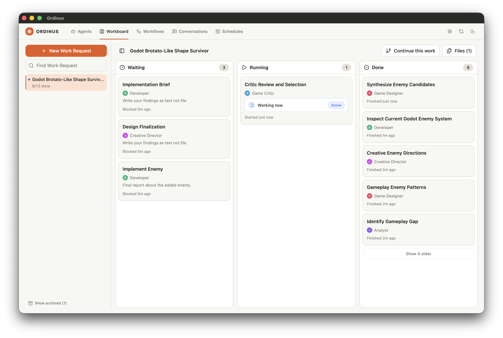

# Shape Survivor — a Godot game in ~12 hours, zero human-written code

> A complete Brotato-like with 6 characters, 7 weapons, 8 waves, a boss, draft upgrades, a shop, and a codex — all procedurally drawn, no assets, no audio dependencies, ~4,600 lines of GDScript. Built end-to-end with a 6-agent Ordinus crew steering each other through 142 tasks.

**Game repo:** https://github.com/muratgur/godot-brotato-like-shape-survivor (the playable Godot project)
**This page:** how Ordinus built it — the prompt I gave, the agents and workflows I set up, what came back.

---

## The ask

This is the exact prompt I dropped into Ordinus on day one:

> I want you to create a GODOT game. It will be a copy of Brotato. We don't have any assets so we need to use shapes that can be found in GODOT. Simple but funny shapes may be. @Creative Director, @Game Designer, @Developer you will all gonna be work in a harmony to create this game. Planner do not give a job to single agent. Try to split the jobs to my agents.

That's it. No design doc, no spec, no shot list. Just three agent mentions and a constraint ("shapes only").

## What came back

A fully playable Godot 4.6 project that ships as **one `.tscn` scene + ~4,600 lines of GDScript across 16 files**. Every visual is drawn in code (`draw_circle`, `draw_polyline`, `draw_colored_polygon`) on a cream "paper" background. Zero textures, zero fonts beyond default, zero audio.

Features (from the game README):

- **6 playable doodles** — Balanced Blob, Quick Dot, Sturdy Square, Fancy Hex, Timid Triangle, Grumpy Wedge — each with its own stats, starter weapon, body silhouette, and idle animation
- **7 weapons** — Volunteer Dot, Panic Pinwheel, Corner Cannon, Dot Swarm, Rude Triangle, Orbit Ruler, Apology Orb — all upgradeable
- **8 waves + boss** — paced spawns, a shop wave, draft choices between waves, a final boss that sheds smaller enemies as it loses HP
- **3 difficulty profiles** — Easy, Normal, Impossible (the last one literally jitters in the menu)
- **In-game codex** — catalogue of characters, enemies, weapons, upgrades
- **Run economy** — ink drops as currency, between-wave shop, upgrade drafts, special pickups

## How Ordinus did it

### By the numbers

| | |
| --- | --- |
| Clock time | ~10.5 hours (Jun 4 13:32 → Jun 5 00:01, with breaks) |
| Human-written code | 0 lines |
| Human direction | ~6 prompts total (initial ask + 3 workflow runs + 2 follow-ups) |
| Work runs in workboard | **142** (140 completed, 1 cancelled, 1 failed) |
| Agents on the crew | 6 |
| Workflows designed | 3 reusable |
| Final game size | 16 GDScript files, ~4,600 lines |

The single failure was a "Final Summary" meta-step that crashed on a JSON parse — not a feature regression. The cancellation was an early "Build Godot Prototype" that I re-routed once I saw the agents were ready for finer-grained tasks.

### The 6-agent crew

I set up a 6-agent crew before the first prompt, each with a sharply defined role. Their profiles are in [`agents/`](agents/) — drop them into your own Ordinus to reuse the same crew.

| Agent | Role | Runs |
| --- | --- | --- |
| **Creative Director** ([profile](agents/creative-director.md)) | Sets fantasy, core loop, quality bar | 21 |
| **Game Designer** ([profile](agents/game-designer.md)) | Translates direction into mechanics, numbers, UX | 42 |
| **Analyst** ([profile](agents/analyst.md)) | Reads code/docs, surfaces gaps before implementation | 22 |
| **Game Critic** ([profile](agents/game-critic.md)) | Stress-tests ideas before they ship | 14 |
| **Developer** ([profile](agents/developer.md)) | Writes the GDScript | 35 |
| **CEO** ([profile](agents/ceo.md)) | Orchestrates, breaks ties, sets priority | 8 |

The split that worked: **Designer + Director + Analyst converge on a brief → Critic stress-tests it → Developer implements**. Most workflows below follow that shape.

### The 3 reusable workflows

After the initial prototype landed, I noticed every new piece of content (enemy, character, level) was going through the same loop. So I codified them as workflow designs in Ordinus and ran them whenever I wanted to add something new.

#### 1. New Enemy ([spec](workflows/new-enemy/README.md))

Used whenever I wanted a new enemy archetype. The Analyst collects current enemy/wave context, then Designer and Director independently propose 3 directions each (gameplay-first vs. concept-first). They converge into a synthesis, the Critic culls, the Developer implements.

#### 2. New Character ([spec](workflows/new-character/README.md))

Same parallel-then-converge shape, but for playable characters. Adds a body-silhouette pass and an idle-animation pass before implementation.

#### 3. Level Expansion ([spec](workflows/level-expansion/README.md))

Used once mid-build to push past the initial 6-wave plan. Inspects current pacing, explores fantasy beats and escalation options in parallel, then commits to a chosen direction with a tech brief.

Each workflow's `README.md` has the full node-by-node spec (agent + instruction + expected output + dependencies). The `design.json` next to it is the raw Ordinus export — passive archive today, importable when Ordinus ships workflow import.

### Workboard snapshot

142 tasks, mostly chained through the workflows above. The first ~40 were one-off setup (creative direction, design spec, prototype skeleton, first weapon). After that, almost everything went through the three reusable workflows — that's why the agent counts skew toward Designer / Developer / Analyst.

## What I learned

**The crew matters more than the prompt.** The initial ask was three lines. The reason it worked is that the 6 agents had crisp, distinct identities before I asked anything. Each agent knew when to defer and when to push. If I had used three generic "AI helper" agents instead of Creative Director / Designer / Critic, I would have gotten three slightly different versions of the same opinion.

**Parallel exploration > sequential committee.** The pattern that consistently produced good work: Designer and Director think *independently* (no shared context yet), then a synthesis step compares their outputs, then the Critic argues with the synthesis. Sequential ("Designer first, then Director adds on") tended to produce safer, blander outputs.

**The Critic earned its keep.** Roughly 1-in-4 ideas got reworked after the Critic step. Without it, the workflows would have shipped first-draft enemies and characters that felt like everything else.

**Reusable workflows compound fast.** The first enemy took ~9 tasks. The fourth enemy took the same ~9 tasks but I didn't have to think about *which* 9. That's where the 12-hour total comes from — not because each task is fast, but because the meta-overhead of "what do I do next?" went to zero.

**What I'd do differently next time:** add a "playtest pass" agent earlier in the loop. The Critic catches design flaws on paper but not feel-flaws that only emerge once the code runs. A round of "play it, write down what felt off" between Implement and Done would tighten the loop further.

## Try it yourself

1. **Clone or download Ordinus** ([install instructions](https://github.com/muratgur/ordinus#download))
2. **Recreate the 6 agents** — copy each markdown in [`agents/`](agents/) into your Agents screen. The fields map 1:1.
3. **Recreate the 3 workflows** — for now (until import lands), use each `workflows/<name>/README.md` as a spec and rebuild the nodes manually in the Workflow Designer. The `overview.png` next to each spec shows the visual layout.
4. **Drop your own ask** — pick a different game genre, point it at your agents, and run.

When Ordinus gains workflow & agent import (it's [on the roadmap](https://github.com/muratgur/ordinus/issues?q=is%3Aissue+export+import)), steps 2 and 3 collapse into "open file → done."

## License

This use-case page and the workflow / agent definitions are MIT-licensed alongside Ordinus. The game itself is also MIT — see the [game repo](https://github.com/muratgur/godot-brotato-like-shape-survivor).
