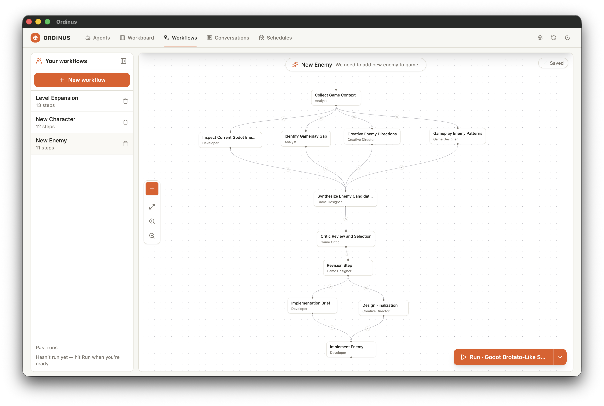

# Workflow — New Enemy

**11 nodes**, **14 connections**.

> This is a markdown spec of the workflow. The original `design.json` is in this same folder — when Ordinus gains workflow import, you'll be able to load it directly. Until then, recreate the nodes manually in your Workflow Designer using the spec below.

## Nodes (execution order)

### #1 — Collect Game Context

**Agent:** Analyst
**Feeds into:** #5, #4, #3, #2

**Instruction:**

> Collect the current context for adding a new enemy to the Godot game.
>
> Inspect the active Godot project and relevant WR history. Read:
> - run_note.md
> - docs/creative_direction_shape_survivor.md
> - docs/game_design_shape_survivor.md
> - project.godot
> - scripts/entities/enemy.gd
> - scripts/main.gd

**Expected output:**

> Do not propose a new enemy yet. Summarize the current enemy roster, wave structure, game identity, and constraints for this workflow.

---

### #2 — Gameplay Enemy Patterns

**Agent:** Game Designer
**Depends on:** #1
**Feeds into:** #6

**Instruction:**

> Create 3 gameplay enemy patterns that would add a new decision to the current game.
>
> Focus on enemy role, behavior loop, counterplay, spawn timing, and how the player should respond. Avoid names, lore, and technical implementation.

**Expected output:**

> Write your findings as text not file

---

### #3 — Creative Enemy Directions

**Agent:** Creative Director
**Depends on:** #1
**Feeds into:** #6

**Instruction:**

> Create 3 creative enemy directions that fit the shape-survivor identity.
>
> Focus on fantasy, silhouette, humor, visual readability, and emotional impact. Do not define exact stats or implementation details.

**Expected output:**

> Write your findings as text not file

---

### #4 — Identify Gameplay Gap

**Agent:** Analyst
**Depends on:** #1
**Feeds into:** #6

**Instruction:**

> Analyze the current enemy roster and wave plan.
>
> Existing enemy types include Wobble Circle, Smug Square, Pointy Triangle, Needle Line, and Chunk Polygon boss.
>
> Identify what gameplay pressure is still missing. Focus on player decisions, combat variety, pacing, counterplay, and redundancy.

**Expected output:**

> Recommend 2-3 enemy opportunity areas, not finished enemy designs. Write your findings as text not file

---

### #5 — Inspect Current Godot Enemy System

**Agent:** Developer
**Depends on:** #1
**Feeds into:** #6

**Instruction:**

> Inspect the current Godot enemy implementation.
>
> Focus on:
> - how enemy kinds are defined
> - how behavior is selected
> - how enemies are drawn
> - how waves spawn enemies
> - what files must change to add one new enemy safely

**Expected output:**

> Do not implement. Produce an implementation map. Write your findings as text not file

---

### #6 — Synthesize Enemy Candidates

**Agent:** Game Designer
**Depends on:** #5, #4, #3, #2
**Feeds into:** #7

**Instruction:**

> Combine the technical map, gameplay gap analysis, creative directions, and gameplay patterns into 3 concrete enemy candidates.
>
> Each candidate must include:
> - enemy name
> - enemy kind id
> - gameplay role
> - behavior loop
> - counterplay
> - visual identity
> - technical fit
> - risk level
>
> Recommend one candidate.

**Expected output:**

> Write your findings as text not file

---

### #7 — Critic Review and Selection

**Agent:** Game Critic
**Depends on:** #6
**Feeds into:** #8

**Instruction:**

> Critically evaluate the enemy candidates.
>
> Reject ideas that are redundant with existing enemies, too complex, unclear to read, unfair, or weakly connected to the gameplay gap.
>
> Select one enemy only if it clearly improves the game.

**Expected output:**

> Return:
> APPROVED, REVISION_REQUIRED, or REJECTED.

---

### #8 — Revision Step

**Agent:** Game Designer
**Depends on:** #7
**Feeds into:** #9, #10

**Instruction:**

> If REVISION_REQUIRED, or REJECTED came from the previous steps, make the necessary revision and pass the new revision to other agents

**Expected output:**

> Revisied  Enemy Candidate. Do not write to a file, send as text

---

### #9 — Implementation Brief

**Agent:** Developer
**Depends on:** #8
**Feeds into:** #11

**Instruction:**

> If the critic decision is not APPROVED, do not continue. Produce a blocked handoff.
>
> If APPROVED, create a small implementation brief for the selected enemy.
>
> Specify:
> - files to change
> - enemy.gd additions
> - main.gd wave/spawn integration
> - expected validation
> - smallest safe implementation path

**Expected output:**

> Write your findings as text not file

---

### #10 — Design Finalization

**Agent:** Creative Director
**Depends on:** #8
**Feeds into:** #11

**Instruction:**

> If the critic decision is not APPROVED, do not continue. Produce revision notes.
>
> If APPROVED, finalize the enemy's creative identity, readable silhouette, color, movement feel, and player-facing personality.
>
> Keep it implementation-sized. Do not expand scope.

**Expected output:**

> Write your findings as text not file

---

### #11 — Implement Enemy

**Agent:** Developer
**Depends on:** #9, #10

**Instruction:**

> Implement the selected enemy only if upstream outputs approve implementation.
>
> Keep the change small and aligned with the existing Godot structure.
>
> Update only the necessary files. Preserve existing enemies and wave behavior unless the brief requires a small spawn integration change.
>
> Run or describe the best available Godot validation.

**Expected output:**

> Final report about the added enemy.

---

